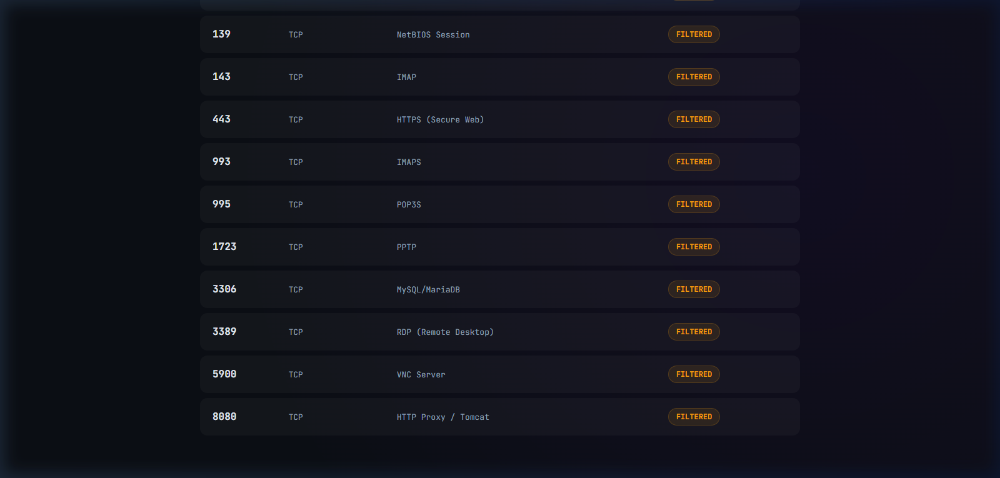
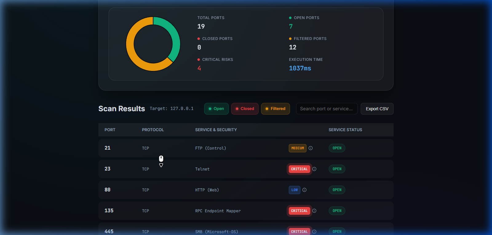
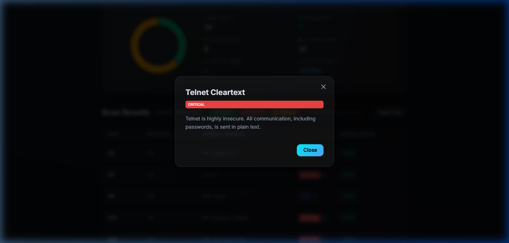

# 📖 Kullanım Kılavuzu

SecOps Port Scanner, hem terminal (CLI) hem de kullanıcı dostu bir web paneli üzerinden çalıştırılabilir. Verimlilik ve hız öncelikli olarak tasarlanmıştır.

## 💻 1. Komut Satırı Arayüzü (CLI)

Terminal üzerinden tarama yapmak için ana programın parametrelerini kullanın. Tüm CLI taramaları otomatik olarak `scans/` dizinine `.json` formatında kaydedilir.

### 📍 Temel Tarama (TCP Connect)

Bu en çok tercih edilen tarama türüdür ve sistem izinleri gerektirmez.

```bash
cargo run -- pentest port-scan 127.0.0.1 --range 1-1000
```

### 🥷 Gizli Tarama (TCP SYN)

*Bu işlem Linux'ta root, Windows'ta Npcap yetkisi gerektirir.*

```bash
# Sadece SYN paketlerini göndererek hızlı bir tarama yapar.
cargo run -- pentest port-scan 192.168.1.1 --syn
```

### ⚡ Yüksek Hızlı Tarama (Concurrency)

Eşzamanlı (`concurrency`) parametresiyle aynı anda taranacak port sayısını belirleyebilir, süreci hızlandırabilirsiniz:

```bash
# Aynı anda 1000 portu tarar.
cargo run -- pentest port-scan 8.8.8.8 -c 1000
```

### 📂 Çıktı Formatları

Taramalarınızı ekrana Markdown (`md`) veya JSON formatında bastırabilirsiniz:

```bash
# Sonuçları JSON olarak terminale yazdırır.
cargo run -- pentest port-scan localhost -f json
```

---

## 🌐 2. Web Kontrol Paneli

Web paneli, tarama sonuçlarını görselleştirmek, geçmiş kayıtları incelemek ve zafiyet veritabanını kullanmak için en verimli yoldur.

### 🚀 Paneli Başlatma

Aşağıdaki komutu vererek web sunucusunu çalıştırın:

```bash
cargo run -- web
```

- **Adres**: [http://localhost:3000](http://localhost:3000)

### ✨ Web Paneli Özellikleri

1.  **Dashboard**: Canlı port durumları ve geçmiş istatistiklerinin grafiksel görünümü.
2.  **Scan Logic**: Hedef IP ve port aralığını seçerek yeni taramalar başlatma.
3.  **Vulnerability Mapping**: Taranan portlardaki bilinen servislerin güvenlik açıklarını (CVE) eşleştirme.
4.  **History (Geçmiş)**: CLI dahil tüm geçmiş tarama dosyalarını (`scans/*.json`) listeleme ve detaylarına erişme.
5.  **Export Options**: Sonuçları CSV veya JSON olarak dışa aktarma (Download).

---

## 🎬 3. Görsel Kullanım Rehberi (Carousel)

Web panelinin nasıl kullanılacağını ve tarama sonuçlarının nasıl analiz edileceğini aşağıdaki interaktif rehberden inceleyebilirsiniz:

````carousel

Tarayıcıyı başlattığınızda sizi karşılayan modern, grafik destekli dashboard ekranı.
<!-- slide -->

Canlı tarama sonuçları: Açık portlar, protokol tipleri ve tespit edilen zafiyet dereceleri (Critical, High, Medium, Low).
<!-- slide -->

Kritik bir bulguya tıklandığında açılan detay penceresi: Zafiyet açıklaması ve çözüm önerileri.
````

---

## 📊 Parametreler Listesi

| Uzun Ad | Kısa | Açıklama | Varsayılan |
| :--- | :---: | :--- | :--- |
| `--range` | `-r` | Taranacak port aralığı (örn. 80,443 veya 1-1024) | `1-1024` |
| `--timeout` | `-t` | Milisaniye cinsinden zaman aşımı süresi | `1000ms` |
| `--concurrency` | `-c` | Eşzamanlı iş parçacığı sayısı (Hız ayarı) | `500` |
| `--syn` |  | Stealth SYN tarama modunu aktif eder | Kapalı |
| `--udp` |  | UDP protokolü üzerinden tarama yapar | Kapalı |
| `--format` | `-f` | Çıktı formatı (`md` veya `json`) | `md` |
